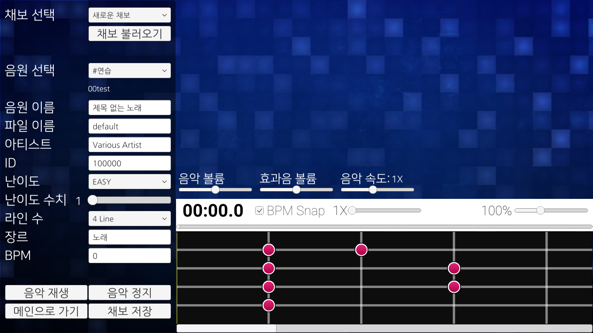
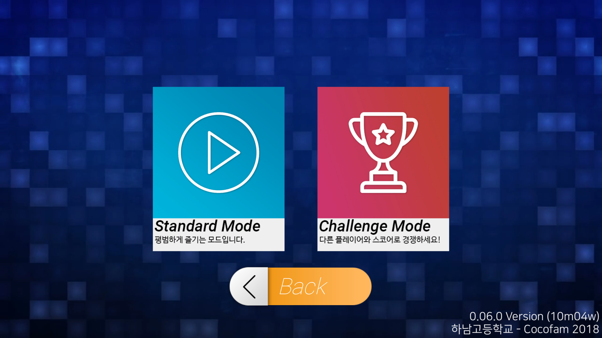
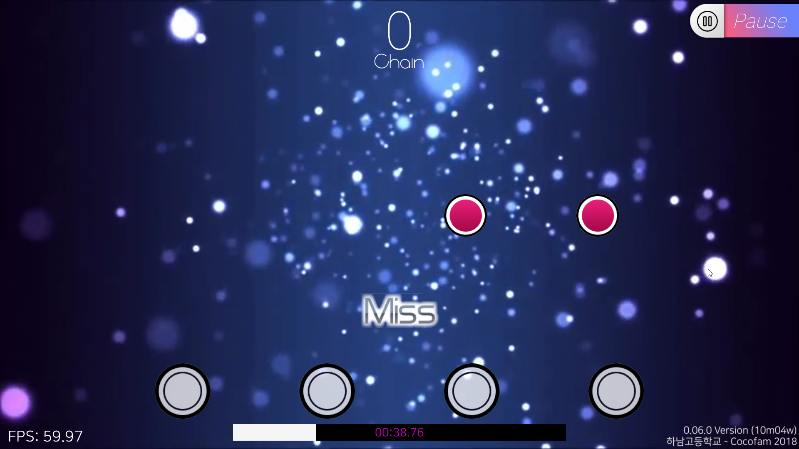

# rhythm-game

고등학교 2학년 여름에 동아리에서 만든 리듬겜입니다 (지금봐도 이걸 고2때 만들었다는게 안믿김)

말이 동아리에서 만든거지 사실 채보빼고 제가 다 만들었습니다. 당시 동아리 회장이었는데 회장 혼자 진심인 동아리....

당시에도 만들고 나서 부끄러움과 뿌듯함이 교차했는데 지금 봐도 그렇네요

### ⓒ Portalcube 2018. distributed under the MIT License.

주: 여기 들어있는 애셋들 대부분(특히 노래)은 제 것이 아닙니다...
