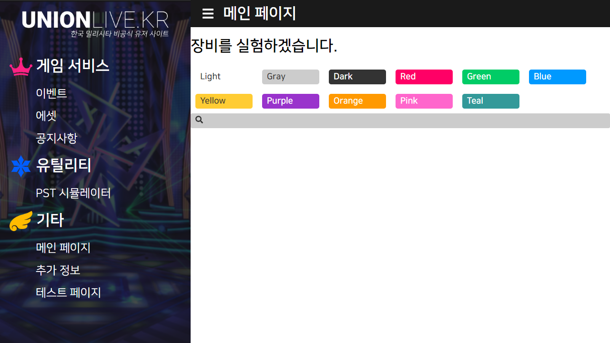

# unionlive-alpha



unionlive.kr 초기 구상버전입니다.

원래는 프론트엔드 프레임워크로 vue만 쓰고, 컴포넌트는 부트스트랩 같은 라이브러리 없이 직접 CSS까지 직접 만들 계획이었으나

컴포넌트까지 완전히 자체 제작하는게 상당히 노가다라는 것을 깨닫고 나서는 그냥 라이브러리 썼습니다.

## Project setup

```
npm install
```

### Compiles and hot-reloads for development

```
npm run serve
```

### Compiles and minifies for production

```
npm run build
```

### Lints and fixes files

```
npm run lint
```

### ⓒ Portalcube 2020. distributed under the MIT License.

주: 일부 애셋은 반다이남코 엔터테인먼트가 권리를 가집니다.
