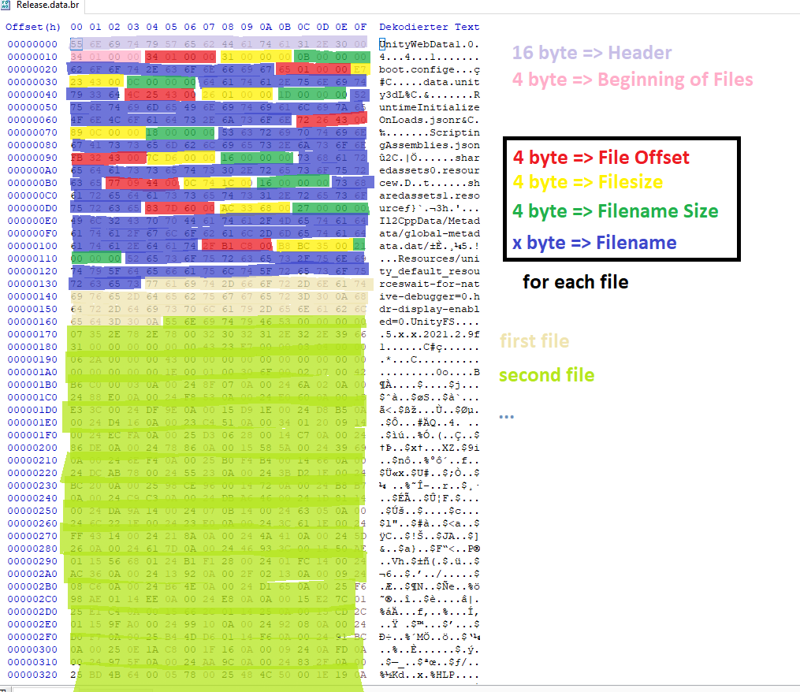

# UnityWebData-Packer

유니티 WebGL 빌드의 게임 데이터 파일을 패킹해주는 툴입니다.

블루 아카이브 2주년 만우절 게임, 밀레니엄 퀘스트의 한글판을 만들기 위해서 제작했습니다. [한글판 바로가기](https://gall.dcinside.com/projectmx/5769023)

본 프로그램은 언패킹을 지원하지 않습니다. 언패킹은 구글에서 찾아보세요...

## data.br 파일 구조

패킹된 파일은 아래의 구조를 갖습니다.



사진 출처: [XenTaX의 게시글](https://forum.xentax.com/viewtopic.php?f=21&p=187239)

## 사용법

1. pack 폴더를 만들고 패킹할 파일을 집어 넣으세요.

1. 아래의 명령어를 실행하세요.

```
npm i
node main.js
```

### MIT License
